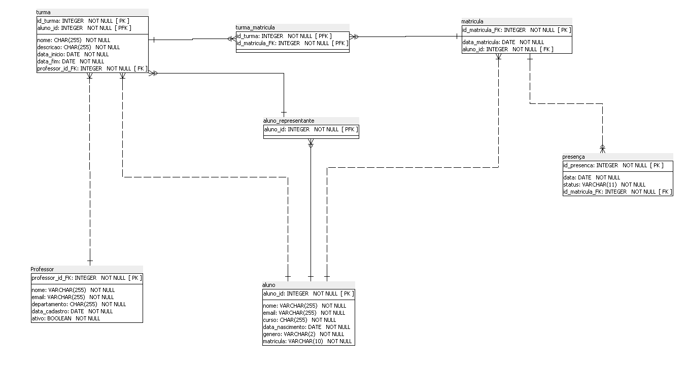

## 🚀 Live Demo
> **Acesse a API em produção:** [https://edutrack-api-8sl3.onrender.com/api/docs/](https://edutrack-api-8sl3.onrender.com/api/docs/)

# API Projeto Django

[](https://www.python.org/downloads/)
[](https://www.djangoproject.com/)
[](https://www.sqlite.org/)
[](https://opensource.org/licenses/MIT)


## Instituições de Fomento e Parceria
[](https://www.ifb.edu.br/) 
[](https://hardware.org.br/)

## Orientador (link para o perfil do orientador)

[](https://br.linkedin.com/in/henrique-freitas-69b836b4)
[-%23181717.svg?logo=github&logoColor=white)](https://github.com/henriquepff/)
[](https://buscatextual.cnpq.br/buscatextual/visualizacv.do;jsessionid=8B62CFB2D86DC88AE42BDFC0BF85BBBE.buscatextual_0)

## Sumário

- [Visão Geral](#visão-geral)
- [Problema que Resolve](#problema-que-resolve)
- [Objetivos Principais](#objetivos-principais)
- [Público Alvo](#público-alvo)
- [Funcionalidades de Alto Nível](#funcionalidades-de-alto-nível)
- [Pacotes Utilizados](#pacotes-utilizados)
- [Estrutura do Projeto](#estrutura-do-projeto)
- [Diagrama de Banco de Dados](#diagrama-de-banco-de-dados)
- [Documentação da API](#documentação-da-api)
- [Configuração do Ambiente](#configuração-do-ambiente)
- [Deploy](#deploy)

## Visão Geral
A EduTrack API é uma solução de backend RESTful desenvolvida para modernizar a gestão de frequência acadêmica. Seu propósito central é digitalizar o processo de chamada e fornecer dados estruturados para análise estatística, servindo como a espinha dorsal para aplicativos de diário de classe digital e para painéis de visualização de dados interativos que usam gráficos e tabelas para exibir indicadores-chave de desempenho e outras métricas de negócios em tempo real.

## Problema que Resolve 
O sistema aborda o desafio crítico do absenteísmo e da evasão escolar no ensino superior. Com dados do INEP apontando taxas de ausência de 20-30%, a falta de monitoramento em tempo real impede intervenções pedagógicas rápidas. A API resolve a ineficiência dos métodos manuais de chamada e a desconexão entre os dados operacionais (presença diária) e os indicadores estratégicos.

## Objetivos Principais

- Centralização de Dados: Gerenciar o ecossistema acadêmico (Professores, Turmas, Alunos) com integridade referencial.

- Monitoramento Analítico: Permitir o cálculo de métricas de engajamento e equidade (gênero/frequência) para embasar políticas públicas.

- Governança Estudantil: Suportar a gestão de representantes de turma para fortalecer a participação discente.

- Segurança: Garantir controle de acesso granular via autenticação por tokens para diferentes perfis de usuários.

## Público-Alvo

- Público-Alvo: Instituições de Ensino (Gestores/Coordenação), Corpo Docente e Discentes.

## Funcionalidades de Alto Nível

- Gestão Acadêmica (CRUD): Cadastro e manutenção de Professores, Alunos e Turmas com validações rigorosas.

- Registro de Frequência: Sistema flexível para marcar presença, ausência ou justificativa.

- Relacionamentos Complexos: Gerenciamento de matrículas, atribuição de docentes e definição de representantes de turma (líderes).

- Dashboards de Dados: Endpoints compostos para visualização consolidada de turmas e estatísticas de presença.

- Controle de Acesso: Rotas públicas para transparência institucional e rotas protegidas para operações de escrita.

## Pacotes Utilizados

Liste todos os pacotes Python necessários, com versões recomendadas. Utilize um formato de tabela para maior clareza.

| Pacote                     | Versão       | Descrição                                                         |
|----------------------------|--------------|-------------------------------------------------------------------|
| django                     | >=5.0        | Framework web principal                                           |
| djangorestframework        | latest       | Toolkit para construção de APIs REST                              |
| django-filter              | latest       | Biblioteca para filtragem de consultas                            |
| drf-spectacular[swagger-ui]| latest       | BIblioteca para documentação interativa Swagger UI                |
| drf-spectacular[sidecar]   | latest       | Extensão para fornecer os arquivos estáticos do Swagger UI e Redoc|
| django-environ             | latest       | Gerenciamento de variáveis de ambiente                            |
| ...                        | ...          | ...                                                               |


> **Nota:** Consulte o arquivo `requirements.txt` para a lista completa.

## Estrutura do Projeto


```
projeto_api/
├── docs/
│   └── database_diagram.png
├── manage.py
├── requirements.txt
├── edutrack/
│   ├── __init__.py
│   ├── settings.py
│   ├── urls.py
│   └── wsgi.py
├── sistema/
│   ├── models.py
│   ├── views.py
│   ├── serializers.py
|   ├── admin.py
│   └── urls.py
|   └── ...
|── db.sqlite3
└── 
```


## Diagrama de Banco de Dados



> **Descrição:** Diagrama ER (Entidade-Relacionamento)

## Documentação da API

A documentação interativa está disponível em `/api/docs/` (Swagger UI) ou `/api/redoc/` (ReDoc) no ambiente de desenvolvimento.

### Endpoints Principais

| Método | Endpoint                  | Descrição                      | Autenticação |
|--------|---------------------------|--------------------------------|--------------|
| GET    | /api/professores/         | Lista todos os professores     | Opcional     |
| POST   | /api/professores/         | Cria um professor              | Requerida    |
| GET    | /api/professores/{id}/    | Detalha um professor           | Opcional     |
| PUT    | /api/professores/{id}/    | Atualiza um professor          | Requerida    |
| DELETE | /api/professores/{id}/    | Remove um professor            | Requerida    |
| GET    | /api/turmas/              | Lista todas as turmas          | Opcional     |
| POST   | /api/turmas/              | Cria uma turma                 | Requerida    |
| GET    | /api/turmas/{id}/         | Detalha uma turma              | Opcional     |
| PUT    | /api/turmas/{id}/         | Atualiza uma turma             | Requerida    |
| DELETE | /api/turmas/{id}/         | Remove uma turma               | Requerida    |
| GET    | /api/alunos/              | Lista todos os alunos          | Opcional     |
| POST   | /api/alunos/              | Cria um aluno                  | Requerida    |
| GET    | /api/alunos/{id}/         | Detalha um aluno               | Opcional     |
| PUT    | /api/alunos/{id}/         | Atualiza um aluno              | Requerida    |
| DELETE | /api/alunos/{id}/         | Remove um aluno                | Requerida    |

Detalhes: Consulte a interface Swagger para schemas completos, exemplos, parâmetros e códigos de resposta.


## Configuração do Ambiente

Siga os passos abaixo para configurar o ambiente local.

1. **Clone o repositório:**
   ```bash
   git clone https://github.com/ArthurDaniel02/Projeto-Integrador.git
   cd Projeto-Integrador
   ```

2. **Crie um ambiente virtual:**
   ```bash
   python -m venv venv
   source venv/bin/activate  # Linux/Mac
   venv\Scripts\activate     # Windows
   ```

3. **Instale as dependências:**
   ```bash
   cd edutrack
   pip install -r requirements.txt
   ```

4. **Configure as variáveis de ambiente:**
   ```bash
   cp .env.example .env
   # Edite .env com suas credenciais
   ```

5. **Aplique as migrações e inicie o servidor:**
   ```bash
   python manage.py migrate
   python manage.py runserver
   ```

## ☁️ Deploy (Produção)

A API está hospedada na plataforma **Render**, utilizando contêineres Docker nativos e banco de dados **PostgreSQL**.

### Configurações de Hospedagem
- **Plataforma:** Render.com
- **Servidor Web:** Gunicorn (WSGI)
- **Banco de Dados:** PostgreSQL (Gerenciado pelo Render)
- **Arquivos Estáticos:** WhiteNoise

### Comandos de Build e Start
Para referência, os comandos utilizados na configuração do serviço foram:

1. **Root Directory:** `edutrack` (Pasta raiz do projeto)
2. **Build Command:**
   ```bash
   pip install -r requirements.txt && python manage.py collectstatic --no-input && python manage.py migrate
3. **Start Command:**
   gunicorn edutrack.wsgi:application --log-file -


